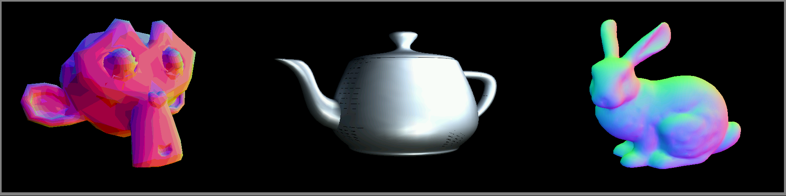

# SoCKET
## System on Chip that Kinda Etches Triangles

<br>

An HDL GPU core with tile-based binning and a rasterization/shading pipeline written in SystemVerilog.

The module is my submission for the COMP32211 (Implementing System on Chip Designs) coursework and targets a Spartan XC7S50 FPGA.

## Overview
SoCKET is a fully custom 3D triangle rasterisation pipeline, designed and implemented entirely in SystemVerilog. It accepts a stream of vertices, performs perspective-correct transformation and uses tile-based binning to drive a parallel raster stage that converts triangles into pixels efficiently.

The core is built from pure RTL with zero reliance on vendor IP blocks. The individual subsystems comprising the module are designed for transparent alteration and simulation.

The design is tuned around the utilisation constraints of the Spartan-7 XC7S50, using techniques such as time-multiplexed DSP sharing and tuned datastructure widths to maximise performance on the FPGA.

The system was developed alongside a Verilator test environment, featuring a C++ harness that feeds mesh data into the pipeline and outputs a bitmap preview of the rendered frame.

## Usage
The [top level GPU module](rtl/gpu.sv) exposes a simple valid/ready streaming interface:
- Input: a [`vertex_t`](./rtl/types/vertex_pkg.svh)
- Output: a stream of [`pixel_buffer_t`](./rtl/types/pixels_pkg.svh)

Details on these datatypes can be found in their respective files. An example interface adapter used in my coursework is located at [gpu_top.sv](./gpu_top.sv).

To simulate the system using the included [C++ harness](./tb/top_tb.cpp), run:

```bash
./run_verilator.sh [--trace]
```

The testbench emits an `out.bmp` image showing the rendered frame.

The input vertices are located at [test_data/input.verts](./test_data/input.verts).
Its format is:
1. First line: Number of vertices
2. Lines 2-5: 4x4 model-view-projection matrix (row-major, real values)
3. Remaining lines: One vertex per line 
    - `x y z` coordinates (real)
    - `R G B` colour (integers 0-255)